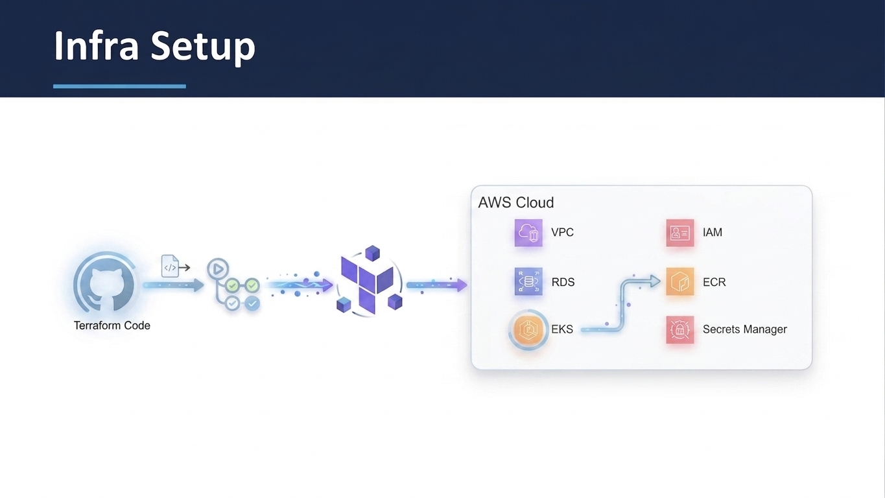

# zen-infra — Implementation Guide


# Test


This guide walks you through setting up the zen-pharma infrastructure on your own AWS account from scratch using this repository. Follow each section in order.


----

1. [Architecture Overview](#1-architecture-overview)
2. [Prerequisites](#2-prerequisites)
3. [Repository Structure](#3-repository-structure)
4. [Step 1 — AWS Account Setup](#4-step-1--aws-account-setup)
5. [Step 2 — S3 State Backend Setup](#5-step-2--s3-state-backend-setup)
6. [Step 3 — Clone the Repository](#6-step-3--clone-the-repository)
7. [Step 4 — Update Configuration for Your Account](#7-step-4--update-configuration-for-your-account)


---

## 1. Architecture Overview

This repository provisions a complete Kubernetes based platform on AWS for the zen-pharma
application. All infrastructure is defined as code in Terraform and deployed automatically
via GitHub Actions no manual AWS console clicks required after initial setup.


---

### AWS Resources Created by Terraform

```
AWS Account (us-east-1)
│
├── S3 Bucket  (created manually — state backend for Terraform)
│   └── zen-pharma-terraform-state-<your-username>
│       ├── envs/dev/terraform.tfstate
│       ├── envs/qa/terraform.tfstate
│       └── envs/prod/terraform.tfstate
│
├── VPC  (10.0.0.0/16)
│   ├── Public Subnets        10.0.1.0/24  (us-east-1a)  ]  NAT Gateway,
│   │                         10.0.2.0/24  (us-east-1b)  ]  NLB, Ingress
│   ├── Private EKS Subnets   10.0.3.0/24  (us-east-1a)  ]  EKS worker
│   │                         10.0.4.0/24  (us-east-1b)  ]  nodes (private)
│   └── Private RDS Subnets   10.0.5.0/24  (us-east-1a)  ]  RDS PostgreSQL
│                             10.0.6.0/24  (us-east-1b)  ]  (private)
│
├── EKS Cluster  (pharma-dev-cluster, Kubernetes 1.33)
│   ├── Managed Node Group
│   │   ├── Instance type : t3.small
│   │   ├── Desired       : 3 nodes
│   │   ├── Min / Max     : 1 / 4
│   │   └── Subnets       : private EKS subnets (no public IP)
│   └── OIDC Provider
│       └── Enables IRSA — pods assume IAM roles without static credentials
│
├── RDS PostgreSQL  (pharma-dev-postgres)
│   ├── Engine        : PostgreSQL 15.7
│   ├── Instance      : db.t3.micro
│   ├── Storage       : 20 GB gp2, encrypted
│   ├── Access        : private subnet only, port 5432 from EKS SG only
│   └── DB name       : pharmadb  /  Master user: pharmaadmin
│
├── ECR Repositories  (8 repos, one per service)
│   ├── api-gateway               (Spring Cloud Gateway, port 8080)
│   ├── auth-service              (JWT auth, port 8081)
│   ├── drug-catalog-service      (drug catalogue, port 8082)
│   ├── inventory-service         (stock management, port 8083)
│   ├── supplier-service          (vendor management, port 8084)
│   ├── manufacturing-service     (batch tracking, port 8085)
│   ├── notification-service      (Node.js, port 3000)
│   └── pharma-ui                 (React frontend, port 80)
│   │
│   └── Each repo has:
│       ├── scan_on_push = true   (automatic CVE scan on every push)
│       └── Lifecycle policy      (keep last 10 images, expire older ones)
│
├── IAM
│   ├── EKS Cluster Role          (allows EKS control plane to manage AWS resources)
│   ├── EKS Node Group Role       (allows worker nodes to pull from ECR, join cluster)
│   │
│   ├── GitHub Actions OIDC Role  (pharma-dev-gitlab-runner-role)
│   │   ├── Trust policy : repo zen-pharma-frontend and zen-pharma-backend only
│   │   └── Permissions  : ECR push/pull, EKS describe
│   │   └── How it works : GitHub OIDC token -> AWS STS -> short-lived credentials
│   │                      No AWS_ACCESS_KEY_ID stored in GitHub
│   │
│   ├── ESO IRSA Role             (pharma-dev-eso-role)
│   │   ├── Trust policy : EKS service account external-secrets/external-secrets
│   │   └── Permissions  : secretsmanager:GetSecretValue on /pharma/* paths only
│   │
│   └── ArgoCD IRSA Role          (pharma-dev-argocd-role)
│       └── Trust policy : EKS service account argocd/argocd-application-controller
│
└── AWS Secrets Manager
    ├── /pharma/dev/db-credentials   {"username": "pharmaadmin", "password": "..."}
    └── /pharma/dev/jwt-secret       {"secret": "..."}
```

Each environment directory (`envs/dev`) calls the modules like functions:

```
envs/dev/main.tf
    |
    |-- module "vpc"              --> modules/vpc/
    |-- module "eks"              --> modules/eks/   (depends on vpc outputs)
    |-- module "rds"              --> modules/rds/   (depends on vpc + eks outputs)
    |-- module "ecr"              --> modules/ecr/
    |-- module "iam"              --> modules/iam/   (depends on eks OIDC outputs)
    └-- module "secrets_manager"  --> modules/secrets-manager/
```

Modules share data via outputs — for example, `module.eks.oidc_provider_arn` is passed
into `module.iam` so the IAM trust policy references the exact OIDC provider created
for this cluster, not a hardcoded ARN.

---

### Network Traffic Flow

```
Internet
    |
    v
AWS Network Load Balancer  (created by NGINX Ingress Controller Helm chart)
    |  routes by URL path
    |-- /          -->  pharma-ui       (React, port 80)
    |-- /api/*     -->  api-gateway     (port 8080)
                           |
                           |-- /api/auth/*          --> auth-service        (8081)
                           |-- /api/catalog/*       --> drug-catalog-svc    (8082)
                           |-- /api/inventory/*     --> inventory-service   (8083)
                           |-- /api/suppliers/*     --> supplier-service    (8084)
                           |-- /api/manufacturing/* --> manufacturing-svc   (8085)
                           └-- /api/notifications/* --> notification-svc    (3000)
                                                            |
                                                    All backend services
                                                    pull secrets from
                                                    AWS Secrets Manager
                                                    via ESO (no passwords
                                                    in pod spec or config)
                                                            |
                                                            v
                                               RDS PostgreSQL (private subnet)
```

---
